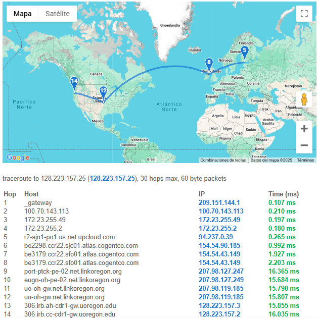
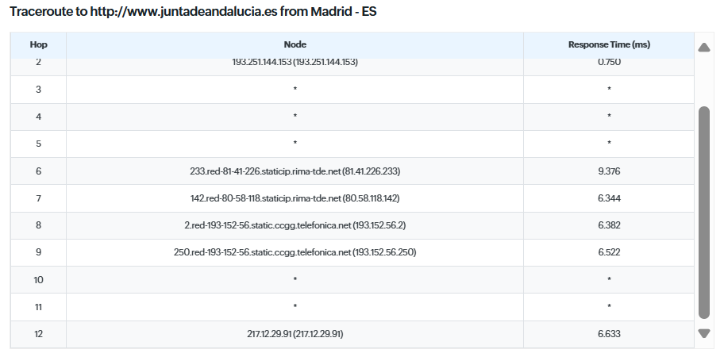

# Ejercicio 1 : Tracert

El comando tracert (abreviatura de "trace route") se utiliza en sistemas operativos Windows para rastrear la ruta que toma un paquete de datos desde tu computadora hasta un destino específico en la red.
Este comando muestra cada salto (router o dispositivo de red) que atraviesa el paquete y el tiempo que tarda en llegar a cada uno de estos saltos.

## Comando

Syntax:

```shell
tracert <destino>
```
Destino: Puede ser una dirección IP o un dominio (por ejemplo, tracert google.com).
Efecto: Muestra cada salto que realiza el paquete, incluyendo el tiempo que tarda (en milisegundos) en llegar a cada nodo/interfaz de red.
## Modificadores

A continuacion enumeramos como podemos modificar los parámetros:

### Limita rastreo a 10 saltos

```shell
tracert -h 10 www.google.es
```

### IP de los nodos

```shell
tracert -d www.google.es
```
### Espera (x) milisegundos
```shell
tracert -w 1000 www.google.es
```
Espera 1 segundo (1000 ms) antes de declarar que un nodo está fuera de servicio.

### Fuerza a usar IPV4 para el rastreo
```shell
tracert -4 www.google.es
```
### Fuerza a usar IPV6 para el rastreo
```shell
tracert -6 www.google.es
```
## Apartado 1 Solucion
- 1. Obten la lista de los routers y sus IPs que hay entre tu pc y el servidor [NSRC](https://nsrc.org/)

````
  1    <1 ms    <1 ms    <1 ms  192.168.1.1
  2     1 ms    <1 ms     1 ms  10.0.20.101
  3     3 ms     2 ms     7 ms  172.16.6.161
  4     2 ms     1 ms     2 ms  10.220.96.1
  5    11 ms    10 ms    10 ms  10.220.126.206
  6    11 ms    10 ms    12 ms  10.220.107.104
  7    11 ms    10 ms    11 ms  81-196-118-212.rdsnet.ro [81.196.118.212]
  8     *        *        *     Tiempo de espera agotado para esta solicitud.
  9    20 ms    20 ms    20 ms  be2421.ccr31.vlc02.atlas.cogentco.com [154.54.61.197]
 10    20 ms    20 ms    19 ms  be3355.ccr31.mad05.atlas.cogentco.com [154.54.57.229]
 11    25 ms    24 ms    24 ms  be2324.ccr31.bio02.atlas.cogentco.com [154.54.61.129]
 12   106 ms   106 ms   106 ms  be2331.ccr41.dca01.atlas.cogentco.com [154.54.85.241]
 13   116 ms   116 ms   115 ms  be2891.ccr21.cle04.atlas.cogentco.com [154.54.82.249]
 14   123 ms   122 ms   122 ms  be2717.ccr41.ord01.atlas.cogentco.com [154.54.6.221]
 15   126 ms   125 ms   126 ms  be5214.ccr31.oma02.atlas.cogentco.com [154.54.165.133]
 16   141 ms   142 ms   141 ms  be3802.ccr21.den01.atlas.cogentco.com [154.54.165.77]
 17   147 ms   146 ms   148 ms  be5821.ccr31.slc01.atlas.cogentco.com [154.54.167.137]
 18   170 ms   170 ms   185 ms  be5824.ccr22.sea02.atlas.cogentco.com [154.54.167.150]
 19   172 ms   172 ms   172 ms  be2670.ccr21.pdx01.atlas.cogentco.com [154.54.42.150]
 20   180 ms   181 ms   181 ms  port-ptck-pe-02.net.linkoregon.org [207.98.127.247]
 21   178 ms   178 ms   178 ms  eugn-oh-pe-02.net.linkoregon.org [207.98.127.249]
 22   177 ms   177 ms   177 ms  uo-oh-gw.net.linkoregon.org [207.98.119.185]
 23     *        *        *     Tiempo de espera agotado para esta solicitud.
 24   183 ms   183 ms   183 ms  306.irb.ah-cdr1-gw.uoregon.edu [128.223.157.3]
 25   179 ms   178 ms   178 ms  nsrc.org [128.223.157.25]

Traza completa.
````
- 2. Investiga qué significan las líneas en las que no aparece IP y en su lugar aparecen asteriscos.
     Si algún nodo muestra * * *, significa que no se recibió respuesta en el tiempo establecido o que el nodo tiene reglas de firewall que bloquean el rastreo.

- 3. Escribe, junto a cada IP, su ubicación geográfica.
No Hagas TODOS! Solo el 4º, el 5º y el
6º salto, y los 3 últimos. Para ello, puedes usar varios servicios: https://www.iplocation.net/,
 https://iplocation.com/, …. (Sólo busca en google ‘ip location’ y elige el que tú quieras)
```
4     2 ms     1 ms     2 ms  10.220.96.1
5    11 ms    10 ms    10 ms  10.220.126.206  Estas direcciones son privadas de mi proveedor ISP
6    11 ms    10 ms    12 ms  10.220.107.104
```
```
23     *        *        *     Tiempo de espera agotado para esta solicitud. no recibe respuesta o tiene reglas firewall.
24   183 ms   183 ms   183 ms  306.irb.ah-cdr1-gw.uoregon.edu [128.223.157.3] Su ISP Universidad de Oregon corresponde a Eugene,Oregon EEUU
25   179 ms   178 ms   178 ms  nsrc.org [128.223.157.25]
```

La dirección IP 128.223.157.25 está asignada a la Universidad de Oregón en Eugene, Estados Unidos, y forma parte del Sistema Autónomo (ASN) AS3582. Este ASN es utilizado por la universidad para gestionar sus políticas de enrutamiento y la comunicación con otras redes en Internet.

4. Hay otras páginas que permiten hacer un traceroute online y visual. Por ejemplo,
   [geotracerroute](https://geotraceroute.com) o también [Gsuite](https://gsuite.tools/es/traceroute). Prueba alguna de estas
   páginas con el mismo destino de antes: nsrc.org. Pega la captura y reflexiona: ¿Por qué sale
   otra ruta distinta para llegar al mismo sitio?

## Apartado 2 Solución
Usa tracert ahora con la web de la Universidad de Almería **(www.ual.es)**. Hazlo de 2 maneras:
• Usando el comando tracert
• Usando la herramienta online [site24x7](https://www.site24x7.com/es/tools/trace-route.html).
Usa como origen, la ubicación más cercana a ti.
• Si te salen muchos * y resulta imposible hacer el ejercicio, prueba con [JuntadeAndalucia](https://www.juntadeandalucia.es/)

```
  1     1 ms    <1 ms    <1 ms  192.168.1.1
  2     1 ms    <1 ms    <1 ms  10.0.20.101
  3     2 ms     1 ms     1 ms  172.16.7.161
  4    11 ms    11 ms    11 ms  10.220.126.206
  5    10 ms    10 ms    10 ms  10.220.107.104
  6    26 ms    26 ms    27 ms  10.220.107.40
  7    23 ms    38 ms    23 ms  81-196-118-208.rdsnet.ro [81.196.118.208]
  8    44 ms    45 ms    51 ms  rediris.baja.espanix.net [193.149.1.26]
  9    52 ms    51 ms    51 ms  ciemat-rt2.ethtrunk2.uv.rt2.val.red.rediris.es [130.206.245.122]
 10    67 ms    67 ms    67 ms  rica-backup-router.red.rediris.es [130.206.211.42]
 11    63 ms    66 ms    62 ms  et-7-0-5.almeria01.red.cica.es [150.214.231.54]
 12    62 ms    63 ms    62 ms  150.214.231.90
 13     *        *        *     Tiempo de espera agotado para esta solicitud.
 14     *        *        *     Tiempo de espera agotado para esta solicitud.
 15     *        *        *     Tiempo de espera agotado para esta solicitud.
 16     *        *        *     Tiempo de espera agotado para esta solicitud.
 17     *        *        *     Tiempo de espera agotado para esta solicitud.
 18     *        *        *     Tiempo de espera agotado para esta solicitud.
 19     *        *        *     Tiempo de espera agotado para esta solicitud.
 20     *        *        *     Tiempo de espera agotado para esta solicitud.
 21     *        *        *     Tiempo de espera agotado para esta solicitud.
 22     *        *        *     Tiempo de espera agotado para esta solicitud.
 23     *        *        *     Tiempo de espera agotado para esta solicitud.
 24     *        *        *     Tiempo de espera agotado para esta solicitud.
```
Salen desmasiados * vamos a intentarlo con junta de Andalucia
```
  1    <1 ms    <1 ms    <1 ms  192.168.1.1
  2     1 ms    <1 ms    <1 ms  10.0.20.101
  3     2 ms     3 ms     2 ms  172.16.6.161
  4     2 ms     1 ms     1 ms  10.220.96.1
  5    14 ms    11 ms    10 ms  10.220.126.206
  6    11 ms    10 ms    11 ms  10.220.107.104
  7    31 ms    11 ms    10 ms  81-196-118-212.rdsnet.ro [81.196.118.212]
  8    10 ms    11 ms    10 ms  bcn-b1-link.ip.twelve99.net [62.115.182.97]
  9     *        *        *     Tiempo de espera agotado para esta solicitud.
 10    18 ms     *       19 ms  telefonica-ic-373007.ip.twelve99-cust.net [62.115.52.141]
 11    19 ms    19 ms    19 ms  216.184.113.249
 12     *        *        *     Tiempo de espera agotado para esta solicitud.
 13    29 ms    28 ms    29 ms  225.red-81-41-226.staticip.rima-tde.net [81.41.226.225]
 14    25 ms    25 ms    24 ms  222.red-217-124-112.static.ccgg.telefonica.net [217.124.112.222]
 15    25 ms    25 ms    24 ms  2.red-193-152-56.static.ccgg.telefonica.net [193.152.56.2]
 16    25 ms    24 ms    25 ms  250.red-193-152-56.static.ccgg.telefonica.net [193.152.56.250]
 17     *        *        *     Tiempo de espera agotado para esta solicitud.
 18     *        *        *     Tiempo de espera agotado para esta solicitud.
 19    25 ms    24 ms    25 ms  217.12.29.90

Traza completa.
```


**El 15 y 16 son iguales tanto por tracert en local como por la web.**
```
15    25 ms    25 ms    24 ms  2.red-193-152-56.static.ccgg.telefonica.net [193.152.56.2]
16    25 ms    24 ms    25 ms  250.red-193-152-56.static.ccgg.telefonica.net [193.152.56.250]
```
Localiza la ip exacta donde confluyen las 2 rutas e investiga algo sobre esa IP (esa primera
IP en común). Lo que puedas: la localización, el nombre de dominio, y si puedes más,
mucho mejor (sabes usar el zenmap: podrías hacerle un análisis)
**La primera ip comun es 193.152.56.2**
Corresponde a Telefonica de España S.A.U - Madrid -
Procedo a hacer el scan con Zenmap intenso sin Ping pero su cortafuegos me repele.
```
Host discovery disabled (-Pn). All addresses will be marked 'up' and scan times may be slower.
Starting Nmap 7.95 ( https://nmap.org ) at 2025-01-25 18:07 Hora estándar romance
NSE: Loaded 157 scripts for scanning.
NSE: Script Pre-scanning.
Initiating NSE at 18:07
Completed NSE at 18:07, 0.00s elapsed
Initiating NSE at 18:07
Completed NSE at 18:07, 0.00s elapsed
Initiating NSE at 18:07
Completed NSE at 18:07, 0.00s elapsed
Initiating Parallel DNS resolution of 1 host. at 18:07
Completed Parallel DNS resolution of 1 host. at 18:07, 0.01s elapsed
Initiating SYN Stealth Scan at 18:07
Scanning 2.red-193-152-56.static.ccgg.telefonica.net (193.152.56.2) [1000 ports]
SYN Stealth Scan Timing: About 29.65% done; ETC: 18:09 (0:01:14 remaining)
SYN Stealth Scan Timing: About 58.65% done; ETC: 18:09 (0:00:43 remaining)
Completed SYN Stealth Scan at 18:09, 103.13s elapsed (1000 total ports)
Initiating Service scan at 18:09
Initiating OS detection (try #1) against 2.red-193-152-56.static.ccgg.telefonica.net (193.152.56.2)
Retrying OS detection (try #2) against 2.red-193-152-56.static.ccgg.telefonica.net (193.152.56.2)
Initiating Traceroute at 18:09
Completed Traceroute at 18:09, 9.09s elapsed
Initiating Parallel DNS resolution of 7 hosts. at 18:09
Completed Parallel DNS resolution of 7 hosts. at 18:09, 0.09s elapsed
NSE: Script scanning 193.152.56.2.
Initiating NSE at 18:09
Completed NSE at 18:09, 5.02s elapsed
Initiating NSE at 18:09
Completed NSE at 18:09, 0.00s elapsed
Initiating NSE at 18:09
Completed NSE at 18:09, 0.00s elapsed
Nmap scan report for 2.red-193-152-56.static.ccgg.telefonica.net (193.152.56.2)
Host is up.
All 1000 scanned ports on 2.red-193-152-56.static.ccgg.telefonica.net (193.152.56.2) are in ignored states.
Not shown: 1000 filtered tcp ports (no-response)
Too many fingerprints match this host to give specific OS details

TRACEROUTE (using proto 1/icmp)
HOP RTT       ADDRESS
1   136.00 ms 192.168.1.1
2   99.00 ms  10.0.20.101
3   99.00 ms  172.16.6.161
4   ... 6
7   61.00 ms  81-196-118-212.rdsnet.ro (81.196.118.212)
8   61.00 ms  ae56.bar2.Barcelona1.Level3.net (213.242.114.213)
9   139.00 ms ae2.3605.edge4.mrs1.neo.colt.net (171.75.8.225)
10  140.00 ms 94.142.107.138
11  ... 30

NSE: Script Post-scanning.
Initiating NSE at 18:09
Completed NSE at 18:09, 0.00s elapsed
Initiating NSE at 18:09
Completed NSE at 18:09, 0.00s elapsed
Initiating NSE at 18:09
Completed NSE at 18:09, 0.00s elapsed
Read data files from: C:\Program Files (x86)\Nmap
OS and Service detection performed. Please report any incorrect results at https://nmap.org/submit/ .
Nmap done: 1 IP address (1 host up) scanned in 123.49 seconds
           Raw packets sent: 2130 (96.968KB) | Rcvd: 36 (2.794KB)
```
